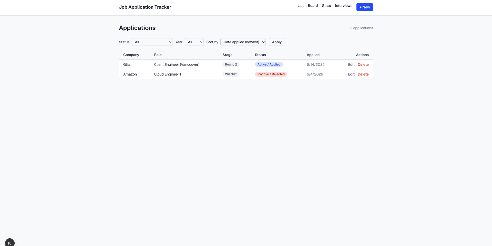
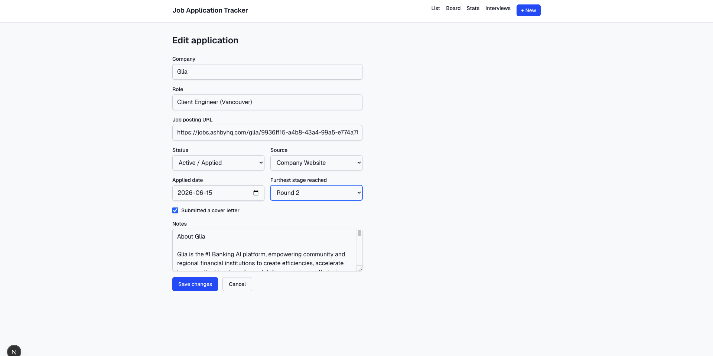
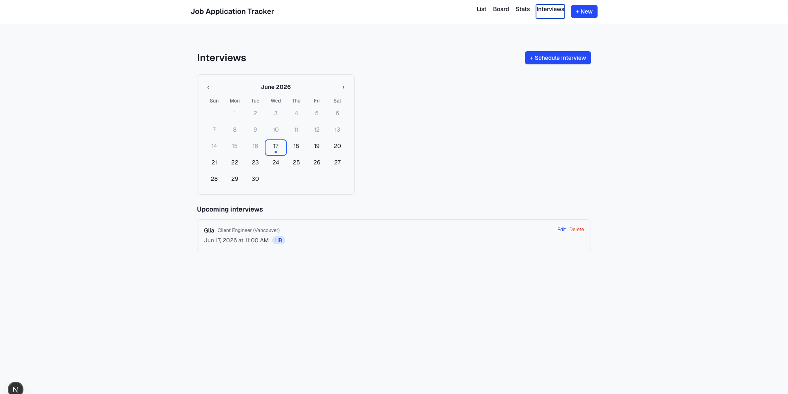
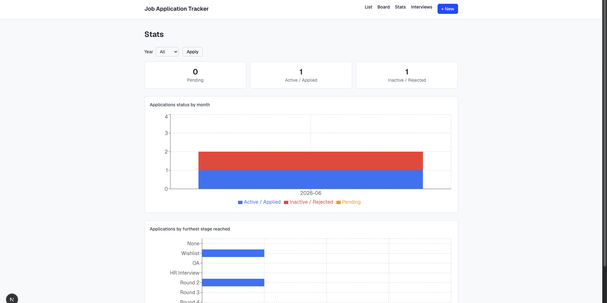

# Job Application Tracker

A small app for tracking job applications from wishlist to offer, built with
Next.js (App Router), Tailwind CSS, and Prisma + SQLite. Track applications
in a list or kanban board, schedule and review interviews, and visualize your
pipeline in the stats dashboard.

## Screenshots

| List view | Add / edit application |
| --- | --- |
|  |  |

| Interviews | Stats |
| --- | --- |
|  |  |

## Features

- **List view** (`/`) — table of all applications with Status
  (Pending / Active / Inactive) and Year filters, sortable by date applied or
  company
- **Add / edit form** (`/applications/new`, `/applications/[id]/edit`) —
  company, role, job posting URL, status, source, applied date, furthest
  stage reached, cover letter checkbox, and notes
- **Kanban board** (`/board`) — drag and drop applications between status
  columns; furthest stage reached updates automatically as cards move
- **Stats dashboard** (`/stats`) — summary cards plus charts for applications
  by month and by furthest stage reached, filterable by year
- **Interviews** (`/interviews`, `/interviews/new`,
  `/interviews/[id]/edit`) — calendar view and upcoming interviews list,
  each interview linked to an application

## Getting started

```bash
npm install
npm run dev
```

Open [http://localhost:3000](http://localhost:3000) to view the app.

The SQLite database (`dev.db`) ships with seed data. To re-seed it:

```bash
npm run db:seed
```

Or to fully reset and re-seed:

```bash
npx prisma migrate reset
```

## Tech stack

- [Next.js](https://nextjs.org) 16 (App Router, TypeScript)
- [React](https://react.dev) 19
- [Tailwind CSS](https://tailwindcss.com) 4
- [Prisma](https://www.prisma.io) 7 with SQLite (via `@prisma/adapter-better-sqlite3`)
- [dnd-kit](https://dndkit.com) for the kanban board
- [Recharts](https://recharts.org) for the stats charts

## Project structure

- `src/app/page.tsx` — list view
- `src/app/board/page.tsx` + `src/components/Board.tsx` — kanban board
- `src/app/stats/page.tsx` + `src/components/StatsCharts.tsx` — stats dashboard
- `src/app/interviews` + `src/components/InterviewCalendar.tsx` — interviews calendar and list
- `src/app/applications/new`, `src/app/applications/[id]/edit` — add/edit application form pages
- `src/app/api/applications` — CRUD API routes
- `prisma/schema.prisma` — data model
- `prisma/seed.ts` — sample data
